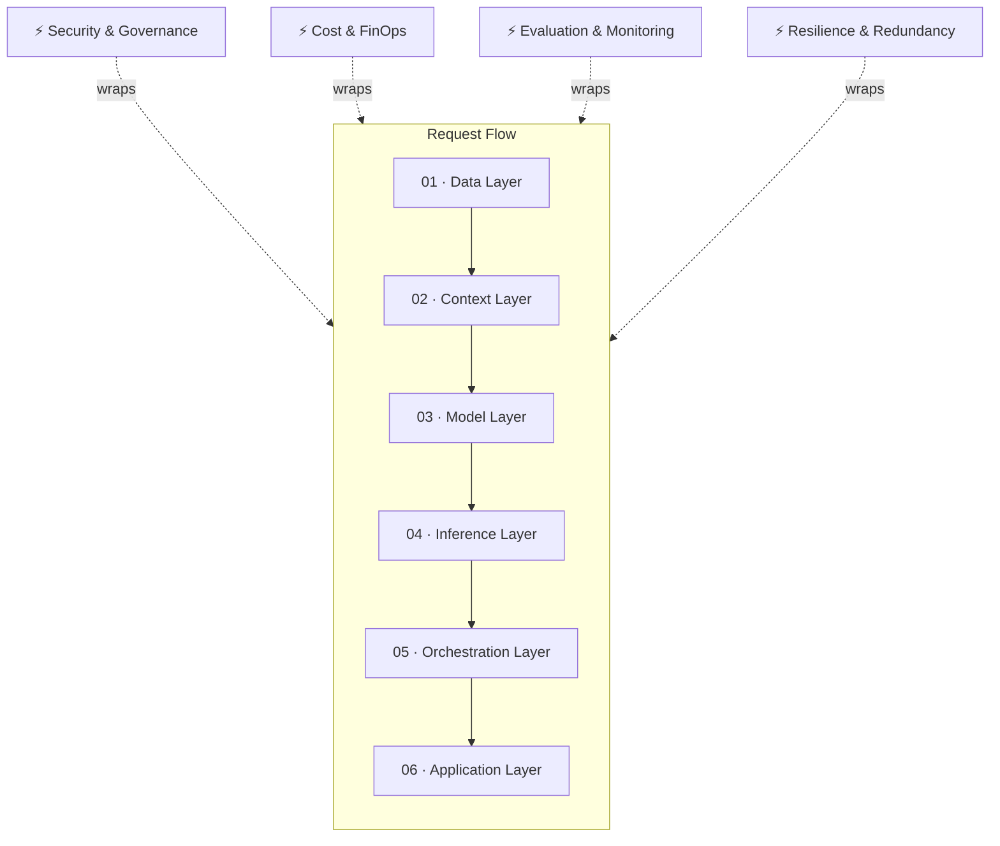

# Dependency Map

The AI system stack as a request pipeline (top to bottom), wrapped by four cross-cutting concerns that touch every layer.

## Pipeline layers

### 01 · Data Layer
**What it is:** Raw and structured data assets — documents, databases, logs, transactional records. The substrate everything else is built on.

**Dependencies:** Data quality, lineage, and access control set the ceiling for every layer above it.

**Interrogate:** Duplication and staleness · Undefined ownership · No lineage tracking

---

### 02 · Context Layer
**What it is:** Embeddings, vector stores, retrieval-augmented generation (RAG), and memory systems that bring relevant data into a model's context window at request time.

**Dependencies:** Depends on Data Layer quality. Feeds the Model Layer with grounded, current information.

**Interrogate:** Retrieval precision vs. recall trade-offs · Chunking strategy · Context window cost

---

### 03 · Model Layer
**What it is:** Foundation models (proprietary or open-weight), fine-tuned variants, and distilled versions — the component that performs reasoning, generation, and classification.

**Dependencies:** Consumes context from Layer 02. Model choice drives Inference Layer cost and latency.

**Interrogate:** Build vs. buy vs. fine-tune · Open-weight vs. closed · Capability vs. cost ceiling

---

### 04 · Inference Layer
**What it is:** The infrastructure that runs model calls in production — batching, quantization, GPU/TPU allocation, caching, latency management.

**Dependencies:** Directly determined by Model Layer choice. Primary driver of unit economics.

**Interrogate:** Latency SLAs · Cold-start cost · Throughput under peak load

---

### 05 · Orchestration Layer
**What it is:** Logic that chains calls, routes between models, invokes tools/functions, and coordinates multi-step or multi-agent workflows.

**Dependencies:** Sits above Inference; calls it repeatedly per task. Complexity here multiplies cost and failure surface.

**Interrogate:** Error propagation across steps · Auditability of agent decisions · Vendor lock-in via proprietary frameworks

---

### 06 · Application Layer
**What it is:** The product surface — UI, API, or workflow integration where output is consumed and acted on.

**Dependencies:** Everything below exists to serve this layer reliably.

**Interrogate:** Output legibility · Human-in-the-loop checkpoints · Failure UX

## Cross-cutting concerns

These don't sit on one layer — they run through all of them.

### Security & Governance
Data residency, access control, prompt-injection defense, encryption, audit trails. A gap here compromises the whole stack regardless of how good the model is.

**Interrogate:** Where does data physically reside? · Who can see raw prompts/outputs? · Is there an audit trail per request?

### Cost & FinOps
Token economics, compute amortization, chargeback models. Cost is a function of every layer's design choices, not a separate line item.

**Interrogate:** Cost per resolved task, not per token · Quota governance by team · Hidden cost of orchestration complexity

### Evaluation & Monitoring
Benchmarks, evals, drift detection, hallucination tracking — the feedback loop that tells you whether the stack is actually working.

**Interrogate:** Evals specific to your task, not generic leaderboards · Production monitoring, not just pre-launch testing

### Resilience & Redundancy
Failover, multi-region/multi-vendor design, degradation strategy — what happens when a layer fails, not just when it works.

**Interrogate:** Single-vendor dependency risk · Graceful degradation vs. hard failure · Recovery time objectives
