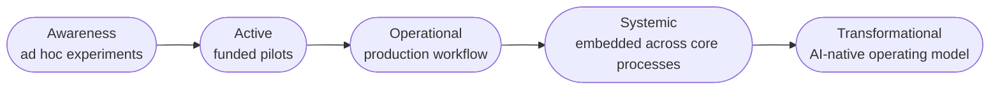

---
tags:
  - lean
  - culture
---

# AI Adoption & Organizational Maturity

How organizations actually move from AI pilots to AI embedded in daily work — the change-management and workforce-readiness side, distinct from the engineering-delivery mechanics covered in Delivery & Operating Practice.

## In this domain

- **[Maturity Stages](#maturity-stages)** — where an organization actually sits, not where it claims to sit (detail below)
- **[Lean AI-Assisted Product Organization](lean-ai-org.md)** — the org design archetype: small autonomous teams, structural (not procedural) cost and security controls

## Maturity Stages

The diagram above follows Gartner's five-stage model — the most widely cited version. Worth being precise about how the three grounding frameworks actually relate, since they don't map 1:1:

- **Gartner (5 stages)** and **MIT CISR (4 stages)** measure the same underlying progression — MIT CISR's stages compress roughly to Gartner's Awareness+Active, Operational, Systemic, and Transformational. Different granularity, same axis.
- **MITRE's model is structured differently** — six *pillars* (capability areas an organization must build across), not sequential stages. It's a different axis entirely: Gartner/MIT CISR answer "how far along is this organization," MITRE answers "which specific capabilities does it need to build." Both are useful; don't treat MITRE's pillars as another version of the same stage ladder.

**Signals per stage, not just labels:**

| Stage | What it actually looks like |
|---|---|
| **Awareness** | Individual teams experimenting ad hoc, no budget line, no shared infrastructure, success measured anecdotally |
| **Active** | Funded pilots exist, but each is siloed — no shared platform, no consistent governance, most pilots never reach production |
| **Operational** | AI is in production for specific workflows, with real monitoring and ownership — but still bounded to the teams that built it |
| **Systemic** | AI is embedded across core processes, with shared platform infrastructure (see [Team Topologies](../delivery-operating-practice/team-topologies.md)) and consistent governance |
| **Transformational** | The operating model itself assumes AI-native workflows by default. The signal to watch for: the org no longer has a meaningful "before AI" baseline left to compare against — AI usage has stopped being a measurable delta and become the default state |

The failure mode this table exists to surface: most organizations self-report higher than their actual stage, because "Active" (funded pilots) *feels* like more progress than it is if none of those pilots have reached "Operational."

## Grounded in

- **MIT CISR's Enterprise AI Maturity Model** (Woerner, Weill, Sebastian) — four research-backed stages, with a documented finding that organizations in the top two stages financially outperform their industry average
- **Gartner's AI Maturity Model** — five stages (Awareness, Active, Operational, Systemic, Transformational), the most widely cited version
- **MITRE's AI Maturity Model** — six pillars, notably including Ethical/Equitable/Responsible Use and Organization as named pillars, not afterthoughts

## Why this is a separate domain from Delivery & Operating Practice

DORA and Team Topologies measure and structure *engineering delivery* — deployment frequency, lead time, team boundaries. This domain measures something upstream and broader: whether the organization's *people, culture, and processes* are actually ready to absorb AI-assisted work, independent of whether the engineering pipeline is fast. A team can have excellent DORA metrics and still be in "Active" maturity — pilots that never scale — because the organizational readiness isn't there.

## Decision Areas

- Which maturity stage is this team or org honestly in — scored against concrete signals, not the best-case pillar?
- Is the cultural/readiness gap named explicitly, or assumed to resolve itself once the technology works?
- Who owns the transition itself — is there a named accountable person, the way Stage 1 of the [AI Product Alignment playbook](../../playbooks/ai-product-alignment/stage-1-discovery.md) requires a named go/no-go owner?

## IRL Lens

**Focus areas & deep dives** — *TBD*

**Case studies** — none directly filed here yet; the [AI Product Alignment playbook's Stage 5](../../playbooks/ai-product-alignment/stage-5-launch-rollout.md) already covers the adjacent change-management failure mode (no plan to train or communicate to affected humans).

**Open questions & trends** — see Landscape, below.

## Related

- [Delivery & Operating Practice](../delivery-operating-practice/index.md) — the engineering-delivery counterpart to this domain's organizational-readiness focus
- [Playbook: AI Product Alignment & Review](../../playbooks/ai-product-alignment/index.md) — Stage 5's change-management non-negotiable is this domain in operational form

## Landscape

### Open Questions

1. **What actually separates the organizations that break through Stage 2?** [MIT CISR's 2024 research](https://mitsloan.mit.edu/ideas-made-to-matter/whats-your-companys-ai-maturity-level) (survey of 721 companies) found most enterprises sit in the first two maturity stages, with financial performance below their industry average — while organizations in the top two stages perform above it. The open question the research doesn't fully resolve: what specific capability or decision moves an organization from Stage 2 (funded pilots) to Stage 3 (scaled, embedded practice), versus staying stuck running pilots indefinitely?

### Trends

1. **Financial performance tracks maturity stage.** Per the same MIT CISR research, the correlation is with maturity *stage* — how deeply AI is embedded into workflows and governance. Spend alone, without stage progression, doesn't show the same financial return.

### Expertise Leads

| Who | Why them |
|---|---|
| **[MIT CISR](https://cisr.mit.edu/publication/EnterpriseAIMaturity_TalkingPoints)** (Woerner, Weill, Sebastian) | Publishes the Enterprise AI Maturity Model — the most rigorously researched, peer-published version of this framework |
| **[Gartner](https://www.gartner.com/en)** | Publishes the most widely cited AI Maturity Model (five stages: Awareness through Transformational) |
| **[MITRE](https://www.mitre.org/)** | Publishes an AI Maturity Model with six pillars, notably naming Ethical/Equitable/Responsible Use and Organization as pillars in their own right, not afterthoughts |

See [Experts & Sources](../../reference/experts.md) for the full directory this is drawn from.
