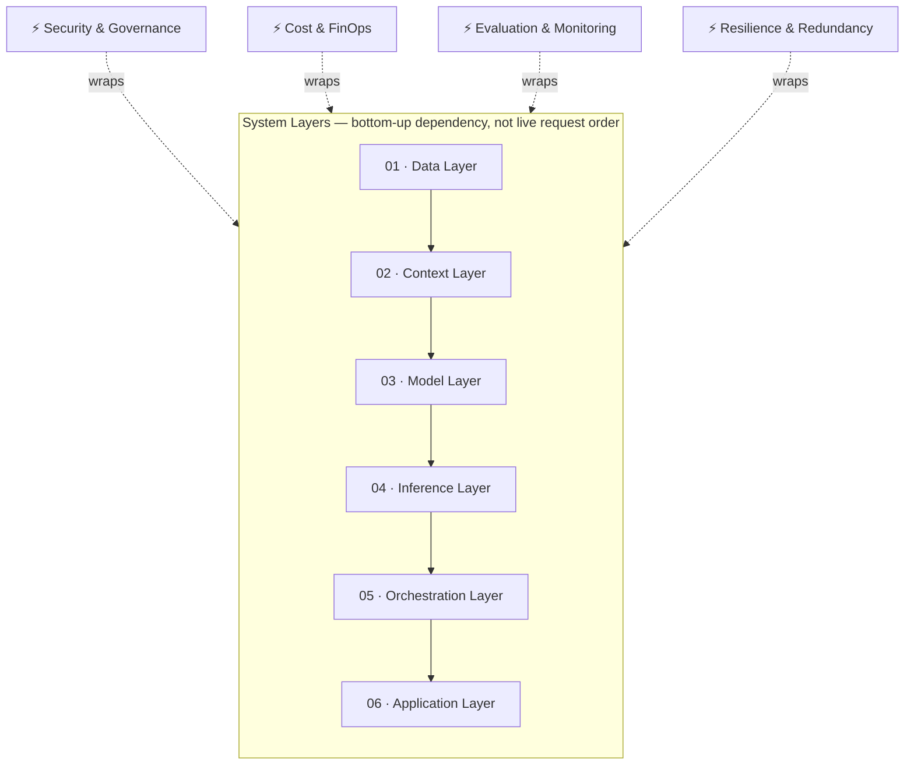

---
tags:
  - architecture
---

# AI Architecture

The technical layers of an AI system, from data to application, and the decisions that connect them.

## In this domain

- **The stack** — the 6-layer pipeline and 4 cross-cutting concerns (detail below)
- **[Efficient Model Routing](model-routing.md)** — directing requests to the right model automatically
- **[Vendor-Agnostic Development](vendor-agnostic-development.md)** — building without hard vendor lock-in
- **[Multi-Vendor Strategy](multi-vendor-strategy.md)** — deliberate redundancy across providers

## The stack — detail

### 01 · Data Layer
Raw and structured data assets — documents, databases, logs, transactional records. Data quality, lineage, and access control set the ceiling for every layer above it.

**Interrogate:** Duplication and staleness · Undefined ownership · No lineage tracking

### 02 · Context Layer
Embeddings, vector stores, retrieval-augmented generation (RAG), and memory systems that bring relevant data into a model's context window at request time.

**Interrogate:** Retrieval precision vs. recall trade-offs · Chunking strategy · Context window cost

### 03 · Model Layer
Foundation models (proprietary or open-weight), fine-tuned variants, and distilled versions — the component that performs reasoning, generation, and classification.

**Interrogate:** Build vs. buy vs. fine-tune · Open-weight vs. closed · Capability vs. cost ceiling

### 04 · Inference Layer
The infrastructure that runs model calls in production — batching, quantization, GPU/TPU allocation, caching, latency management.

**Interrogate:** Latency SLAs · Cold-start cost · Throughput under peak load

### 05 · Orchestration Layer
Logic that chains calls, routes between models, invokes tools/functions, and coordinates multi-step or multi-agent workflows.

**Interrogate:** Error propagation across steps · Auditability of agent decisions · Vendor lock-in via proprietary frameworks

### 06 · Application Layer
The product surface — UI, API, or workflow integration where output is consumed and acted on.

**Interrogate:** Output legibility · Human-in-the-loop checkpoints · Failure UX

## Cross-cutting concerns

These run through all six layers rather than sitting on one.

**Security & Governance** — data residency, access control, prompt-injection defense, encryption, audit trails. See the [AI Security](../ai-security/index.md) and [Data Governance](../data-governance/index.md) domains for depth.

**Cost & FinOps** — token economics, compute amortization, chargeback models. Cost is a function of every layer's design choices, not a separate line item.

**Evaluation & Monitoring** — benchmarks, evals, drift detection, hallucination tracking — the feedback loop that confirms the stack is actually working.

**Resilience & Redundancy** — failover, multi-region/multi-vendor design, degradation strategy.
