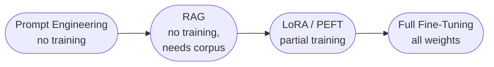

---
tags:
  - architecture
  - cost
  - evaluation
---

# Fine-Tuning & Model Adaptation

*The most expensive lever — and the one most often reached for too early*

Previously a single phrase ("build vs. buy vs. fine-tune") inside the Model Layer description. Given how often this decision gets made prematurely — before prompting and RAG have been genuinely exhausted — it earns its own page.

## The adaptation ladder, cheapest to most expensive

1. **Prompt engineering** — no training, no data collection. See [Prompt Engineering](prompt-engineering.md).
2. **RAG** — no training, but requires a retrieval corpus and infrastructure. See [RAG & Agent Architecture](rag-agent-architecture.md).
3. **LoRA / parameter-efficient fine-tuning** — trains small additional weight matrices instead of the full model. Meaningfully cheaper than full fine-tuning in compute and data volume, and the model can be swapped back to base behavior by removing the adapter.
4. **Full fine-tuning** — updates all model weights. Most expensive, most capable of genuinely shifting model behavior, requires the most training data and the most rigorous eval discipline to avoid regressions on capabilities the fine-tune wasn't targeting.

## Preference-based adaptation — a distinct sub-category

Fine-tuning on labeled examples teaches a model *what* to say. A separate technique teaches it *which of several outputs a human would prefer* — this is alignment territory, not just capability territory:

- **RLHF** (Reinforcement Learning from Human Feedback) — [Ouyang et al., OpenAI, 2022](https://arxiv.org/abs/2203.02155), the paper behind InstructGPT. Trains a reward model from human preference labels, then optimizes the policy against it with reinforcement learning. Effective, but a genuinely complex training pipeline to run correctly.
- **DPO** (Direct Preference Optimization) — [Rafailov et al., Stanford, 2023](https://arxiv.org/abs/2305.18290). Reformulates the same preference-alignment objective as a simple classification loss, skipping the separate reward model and RL loop entirely. Substantially simpler to implement, and the current default starting point for preference alignment in most open fine-tuning pipelines.

## When fine-tuning actually beats prompting

Not "when prompting feels annoying" — the legitimate cases:

- The task requires a response *style or format* so consistent that few-shot examples can't reliably enforce it at the volumes needed
- The knowledge or behavior needed isn't well-represented in the base model's training distribution at all — RAG can't retrieve what doesn't exist as retrievable content (e.g., a highly specific reasoning pattern, not a fact)
- Per-request cost matters enough that eliminating few-shot examples from every prompt produces a meaningful savings at scale

## Decision Areas

- Has prompting and RAG genuinely been exhausted and measured against the eval set, or is fine-tuning being reached for because the team has training infrastructure and wants to use it?
- Is there enough labeled data to fine-tune well? A small, low-quality fine-tuning dataset often produces a worse model than a well-engineered prompt.
- Is there a rollback path if the fine-tuned model regresses on a capability nobody thought to eval? See [Evaluation & Observability](../evaluation-observability/index.md) on eval sets that only cover the happy path.

## Product Ops Lens

- **Cross-team dependency:** A fine-tuned model is usually tied to one specific use case's data and behavior — reusing it across product teams without re-evaluation risks silently degrading a use case it was never tuned for.
- **Team topology implication:** Fine-tuning infrastructure (training pipeline, eval discipline) is platform-team territory; deciding *when* to fine-tune is a joint product/architecture call, not an engineering-only decision.
- **OKR / roadmap implication:** Fine-tuning is the longest-lead-time lever on the adaptation ladder — a roadmap commitment assuming a fine-tune will be ready by a date needs that lead time planned explicitly, not treated like a quick prompt change.
- **Budget implication:** Full fine-tuning is a genuinely significant compute and data cost line — this is the point in the stack where AI cost stops being a rounding error and becomes a real budget conversation.
- **Who to loop in:** Data Scientist for feasibility and data sufficiency, Cost & FinOps counterpart for the investment case, PM for whether the use case actually justifies this lever over the cheaper ones first.

## Source

Chip Huyen, *AI Engineering* — fine-tuning gets a full chapter, positioned deliberately after prompting and RAG, not before them. [Ouyang et al.](https://arxiv.org/abs/2203.02155) for RLHF, [Rafailov et al.](https://arxiv.org/abs/2305.18290) for DPO.

## Related

- [AI/ML Systems Engineering](index.md) — the Model Layer this page expands on
- [Prompt Engineering](prompt-engineering.md) — the cheaper lever to exhaust first
- [RAG & Agent Architecture](rag-agent-architecture.md) — the other cheaper lever, for knowledge gaps specifically
- [Dataset Engineering](dataset-engineering.md) — fine-tuning quality is bounded by the dataset behind it
- [Cost & FinOps](../../reference/cost-finops.md) — fine-tuning's cost profile is fundamentally different from inference-time techniques
