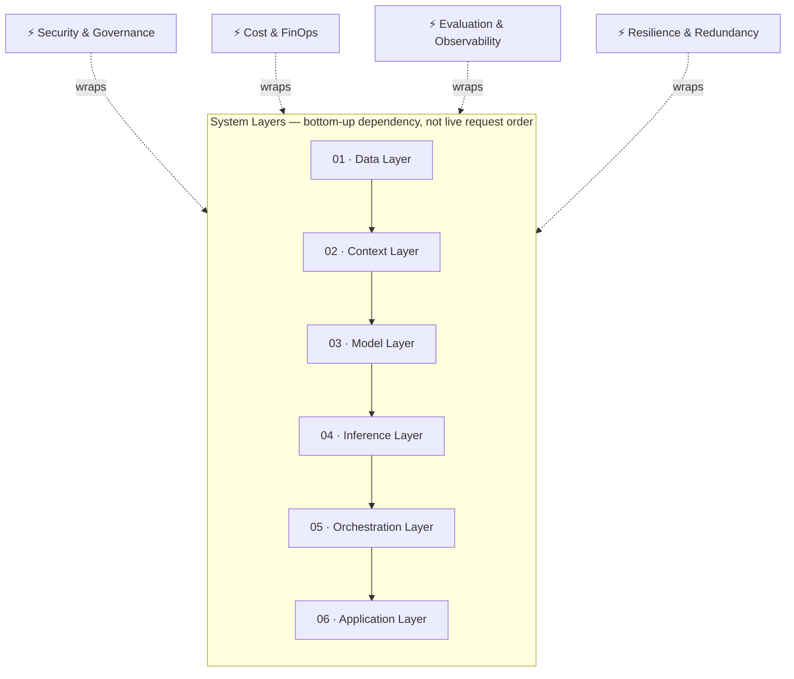

---
tags:
  - architecture
---

# AI/ML Systems Engineering

The technical layers of an AI system, from data to application, and the decisions that connect them. Grounded in Chip Huyen's *AI Engineering* and *Designing Machine Learning Systems* — the most-referenced practitioner texts structuring this discipline.

## In this domain

- **The stack** — the 6-layer pipeline and 4 cross-cutting concerns (detail below)
- **[Efficient Model Routing](model-routing.md)** — directing requests to the right model automatically
- **[Vendor-Agnostic Development](vendor-agnostic-development.md)** — building without hard vendor lock-in
- **[Multi-Vendor Strategy](multi-vendor-strategy.md)** — deliberate redundancy across providers

## The stack — detail

### 01 · Data Layer
Raw and structured data assets — documents, databases, logs, transactional records. Data quality, lineage, and access control set the ceiling for every layer above it.

**Interrogate:** Duplication and staleness · Undefined ownership · No lineage tracking

### 02 · Context Layer
Embeddings, vector stores, retrieval-augmented generation (RAG), and memory systems that bring relevant data into a model's context window at request time.

**Interrogate:** Retrieval precision vs. recall trade-offs · Chunking strategy · Context window cost

### 03 · Model Layer
Foundation models (proprietary or open-weight), fine-tuned variants, and distilled versions — the component that performs reasoning, generation, and classification.

**Interrogate:** Build vs. buy vs. fine-tune · Open-weight vs. closed · Capability vs. cost ceiling

### 04 · Inference Layer
The infrastructure that runs model calls in production — batching, quantization, GPU/TPU allocation, caching, latency management.

**Interrogate:** Latency SLAs · Cold-start cost · Throughput under peak load

### 05 · Orchestration Layer
Logic that chains calls, routes between models, invokes tools/functions, and coordinates multi-step or multi-agent workflows.

**Interrogate:** Error propagation across steps · Auditability of agent decisions · Vendor lock-in via proprietary frameworks

### 06 · Application Layer
The product surface — UI, API, or workflow integration where output is consumed and acted on.

**Interrogate:** Output legibility · Human-in-the-loop checkpoints · Failure UX

## Cross-cutting concerns

These run through all six layers rather than sitting on one. Two of the four now have their own domain or dedicated page — linked here rather than re-explained.

**Security & Governance** — data residency, access control, prompt-injection defense, encryption, audit trails. See [AI Security & Risk](../ai-security-risk/index.md) and [Data Governance](../data-governance/index.md).

**[Cost & FinOps](../../reference/cost-finops.md)** — token economics, compute amortization, chargeback models. Cost is a function of every layer's design choices, not a separate line item. Cross-cutting practice, not a standalone domain — see the linked page for why.

**[Evaluation & Observability](../evaluation-observability/index.md)** — benchmarks, evals, drift detection, hallucination tracking. Elevated to its own domain; this page links out rather than duplicating it.

**Resilience & Redundancy** — failover, multi-region/multi-vendor design, degradation strategy.

## IRL Lens

**Focus areas & deep dives** — *TBD*

**Case studies** — *TBD*

**Open questions & trends** — see Landscape, below.

## Related

- [Evaluation & Observability](../evaluation-observability/index.md)
- [AI Security & Risk](../ai-security-risk/index.md)
- [Cost & FinOps](../../reference/cost-finops.md)

## Landscape

### Open Questions

1. **Cost-performance curve** — Will inference cost keep falling fast enough to sustain enterprise-scale adoption, or does it plateau?
2. **Standardization vs. lock-in** — Will open protocols (e.g. [MCP](https://modelcontextprotocol.io/)) create real interoperability, or become a new layer of vendor lock-in?

### Trends

1. **Agentic architectures** — Shift from single-shot prompting to multi-step, tool-using agents as the default design pattern.
2. **Inference cost collapse** — Smaller, distilled, and open-weight models closing the gap with frontier models at a fraction of the cost.
3. **Interoperability protocols** — Standards like [MCP](https://modelcontextprotocol.io/) reducing custom integration work between models, tools, and data sources.

### Expertise Leads

Who to check first for the best current solution in this domain — mix of individuals and organizations, not ranked.

| Who | Why them |
|---|---|
| **[Chip Huyen](https://huyenchip.com/books/)** | Author of *AI Engineering* and *Designing Machine Learning Systems* — the most-referenced practitioner texts structuring this discipline |
| **[Andrej Karpathy](https://www.youtube.com/@AndrejKarpathy)** | First-principles explainer; former Tesla AI / OpenAI |
| **[Jay Alammar](https://newsletter.languagemodels.co/)** | Visual explanations of transformer architecture — foundational, but note his active publishing moved to Substack in March 2025; his older `jalammar.github.io` posts are archived, not updated |
| **[3Blue1Brown (Grant Sanderson)](https://www.3blue1brown.com/lessons/gpt/)** | The comparably fresh, actively-maintained visual explainer for how transformers/neural networks actually work — worth pairing with Alammar's foundational posts, not a replacement for them |
| **[NVIDIA](https://www.nvidia.com/en-us/data-center/products/tensorrt/)** | Owns the compute and inference-serving layer (GPUs, TensorRT, Triton) underneath nearly every other player's stack |

See [Experts & Sources](../../reference/experts.md) for the full directory this is drawn from.
