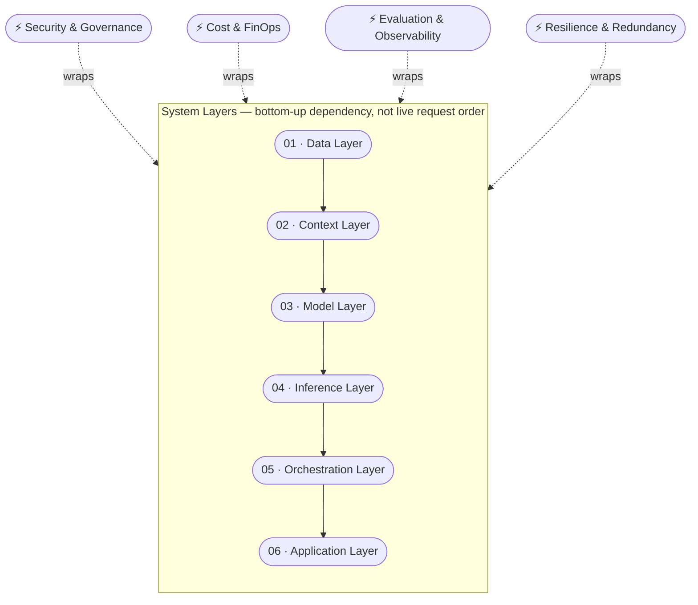

---
tags:
  - architecture
---

# AI/ML Systems Engineering

The technical layers of an AI system, from data to application, and the decisions that connect them.

## Grounded in

- **Chip Huyen, *AI Engineering* and *Designing Machine Learning Systems*** — the most-referenced practitioner synthesis structuring this discipline
- **[MLSys](https://mlsys.org/)** (Conference on Machine Learning and Systems) — the actual peer-reviewed academic venue at the intersection of ML and systems; this is where the discipline institutionally lives, not just where it's written about
- **["Hidden Technical Debt in Machine Learning Systems"](https://papers.nips.cc/paper/5656-hidden-technical-debt-in-machine-learning-systems)** (Sculley et al., Google, NeurIPS 2015) — the foundational peer-reviewed paper that formalized ML-systems thinking as a discipline (boundary erosion, entanglement, hidden feedback loops, the CACE principle), predating and underpinning most practitioner treatments since

## In this domain

- **The stack** — the 6-layer pipeline and 4 cross-cutting concerns (detail below)
- **[Prompt Engineering](prompt-engineering.md)** — the cheapest lever, usually the first one to pull
- **[RAG & Agent Architecture](rag-agent-architecture.md)** — closing knowledge gaps and coordinating multi-step work
- **[Fine-Tuning & Model Adaptation](fine-tuning.md)** — the most expensive lever, and the one reached for too early most often
- **[Dataset Engineering](dataset-engineering.md)** — how training and eval datasets actually get built
- **[Inference Optimization](inference-optimization.md)** — what "batching, quantization, GPU allocation" means in 2026
- **[Efficient Model Routing](model-routing.md)** — directing requests to the right model automatically
- **[Vendor-Agnostic Development](vendor-agnostic-development.md)** — building without hard vendor lock-in
- **[Multi-Vendor Strategy](multi-vendor-strategy.md)** — deliberate redundancy across providers

## The stack — detail

### 01 · Data Layer
Raw and structured data assets — documents, databases, logs, transactional records. Data quality, lineage, and access control set the ceiling for every layer above it. See [Dataset Engineering](dataset-engineering.md) for how training/eval datasets specifically get built, and [Data Governance](../data-governance/index.md) for who's accountable for the standard.

**Decision Areas:** Duplication and staleness · Undefined ownership · No lineage tracking

### 02 · Context Layer
Embeddings, vector stores, retrieval-augmented generation (RAG), and memory systems that bring relevant data into a model's context window at request time. See [RAG & Agent Architecture](rag-agent-architecture.md) for the actual patterns.

**Decision Areas:** Retrieval precision vs. recall trade-offs · Chunking strategy · Context window cost

### 03 · Model Layer
Foundation models (proprietary or open-weight), fine-tuned variants, and distilled versions — the component that performs reasoning, generation, and classification. See [Prompt Engineering](prompt-engineering.md) and [Fine-Tuning & Model Adaptation](fine-tuning.md) for the adaptation ladder, cheapest to most expensive.

**Decision Areas:** Build vs. buy vs. fine-tune · Open-weight vs. closed · Capability vs. cost ceiling

### 04 · Inference Layer
The infrastructure that runs model calls in production. See [Inference Optimization](inference-optimization.md) for current technique — this bullet list used to be the whole page; it's now a dedicated one.

**Decision Areas:** Latency SLAs · Cold-start cost · Throughput under peak load

### 05 · Orchestration Layer
Logic that chains calls, routes between models, invokes tools/functions, and coordinates multi-step or multi-agent workflows. See [RAG & Agent Architecture](rag-agent-architecture.md) and [Efficient Model Routing](model-routing.md).

**Decision Areas:** Error propagation across steps · Auditability of agent decisions · Vendor lock-in via proprietary frameworks

### 06 · Application Layer
The product surface — UI, API, or workflow integration where output is consumed and acted on.

**Decision Areas:** Output legibility · Human-in-the-loop checkpoints · Failure UX

## Cross-cutting concerns

These run through all six layers rather than sitting on one — what each concern actually means at each layer:

| Layer | Security & Governance | Cost & FinOps | Evaluation & Observability | Resilience & Redundancy |
|---|---|---|---|---|
| **Data** | Access control, PII classification, residency | Storage & pipeline compute cost | Quality checks, drift detection at source | Backup, replication — no single data store as SPOF |
| **Context** | Retrieval access scoping | Embedding/indexing compute, vector DB cost | Retrieval precision/recall monitoring | Vector store failover, stale-index fallback |
| **Model** | Provenance, licensing, supply-chain risk | Training/fine-tune cost, licensing fees | Eval suites, benchmark tracking, bias testing | Pinned versions, rollback to prior model |
| **Inference** | Prompt-injection defense, output filtering | Cost per request, batching efficiency | Latency/quality monitoring, hallucination tracking | Circuit breakers, multi-region, graceful degradation |
| **Orchestration** | Tool-permission scoping, action-approval gates | Orchestration complexity as a cost multiplier | Step-level tracing, decision auditability | Retry/timeout logic, blast-radius containment |
| **Application** | Output consent, audit trail to end user | Feature-level cost attribution | User feedback loops, outcome tracking | Fallback UX, kill switch |

Full explainers: [AI Security & Risk](../ai-security-risk/index.md) and [Data Governance](../data-governance/index.md) (Security & Governance) · [Cost & FinOps](../../reference/cost-finops.md) · [Evaluation & Observability](../evaluation-observability/index.md) · circuit breakers and blast radius are detailed in [CI-by-Design](../delivery-operating-practice/ci-by-design.md) (Resilience & Redundancy).

## Product Ops Lens

Domain-wide synthesis — each sub-page has its own specific version of this section; this is the roll-up.

- **Cross-team dependency:** This stack is where "why is this feature slow, expensive, or inconsistent" questions actually get answered. Product ops needs enough fluency here to translate between what a product team wants and what the stack can deliver — and to catch when one team's model, routing, or context choice silently changes another team's constraints.
- **Team topology implication:** Whether this stack is owned by embedded engineers per product team or a shared platform team is the single biggest structural decision this domain touches. Ownership tends to concentrate at the Model and Inference layers specifically — see [Team Topologies](../delivery-operating-practice/team-topologies.md).
- **OKR / roadmap implication:** Any roadmap commitment that depends on a specific layer's capability — a new model, a new routing pattern, a fine-tune — needs that dependency named as a planning input, not discovered at sprint review.
- **Budget implication:** This entire domain is the cost surface for AI-assisted product work — see [Cost & FinOps](../../reference/cost-finops.md). Every layer's design choice compounds into the number product ops eventually has to explain to finance.
- **Who to loop in:** AI/ML Engineer for implementation feasibility, Architect for cross-layer tradeoffs, Cost & FinOps counterpart for budget impact — named more specifically per layer and per sub-page above.

## IRL Lens

**Focus areas & deep dives** — *TBD*

**Case studies** — *TBD*

**Open questions & trends** — see Landscape, below.

## Related

- [Evaluation & Observability](../evaluation-observability/index.md)
- [AI Security & Risk](../ai-security-risk/index.md)
- [Cost & FinOps](../../reference/cost-finops.md)
- [Delivery & Operating Practice](../delivery-operating-practice/index.md) — circuit breakers, blast radius, the Resilience & Redundancy detail

## Landscape

### Open Questions

1. **Cost-performance curve** — Will inference cost keep falling fast enough to sustain enterprise-scale adoption, or does it plateau?
2. **Standardization vs. lock-in** — Will open protocols (e.g. [MCP](https://modelcontextprotocol.io/)) create real interoperability, or become a new layer of vendor lock-in?
3. **No AI-specific workload classification research found.** Vendor-portability decision-making currently has to borrow from general cloud-infrastructure research (switching cost, compliance, differentiation — see [Vendor-Agnostic Development](vendor-agnostic-development.md)) rather than a framework built for AI model selection specifically. Worth watching for whether one emerges as the field matures, rather than treating the borrowed framework as a permanent answer.

### Trends

1. **Agentic architectures** — Shift from single-shot prompting to multi-step, tool-using agents as the default design pattern.
2. **Inference cost collapse** — Smaller, distilled, and open-weight models closing the gap with frontier models at a fraction of the cost.
3. **Interoperability protocols** — Standards like [MCP](https://modelcontextprotocol.io/) reducing custom integration work between models, tools, and data sources.

### Expertise Leads

Who to check first for the best current solution in this domain — mix of individuals and organizations, not ranked.

| Who | Why them |
|---|---|
| **[Chip Huyen](https://huyenchip.com/books/)** | Author of *AI Engineering* and *Designing Machine Learning Systems* — the most-referenced practitioner texts structuring this discipline |
| **[Matei Zaharia](https://mlsys.org/)** | Stanford-affiliated (moving to Berkeley), Databricks co-founder, MLSys steering committee — the working-researcher voice this list was missing alongside its educators and vendors |
| **[Andrej Karpathy](https://www.youtube.com/@AndrejKarpathy)** | First-principles explainer; former Tesla AI / OpenAI |
| **[Jay Alammar](https://newsletter.languagemodels.co/)** | Visual explanations of transformer architecture — foundational, but note his active publishing moved to Substack in March 2025; his older `jalammar.github.io` posts are archived, not updated |
| **[3Blue1Brown (Grant Sanderson)](https://www.3blue1brown.com/lessons/gpt/)** | The comparably fresh, actively-maintained visual explainer for how transformers/neural networks actually work — worth pairing with Alammar's foundational posts, not a replacement for them |
| **[NVIDIA](https://www.nvidia.com/en-us/data-center/products/tensorrt/)** | Owns the compute and inference-serving layer (GPUs, TensorRT, Triton) underneath nearly every other player's stack |

See [Experts & Sources](../../reference/experts.md) for the full directory this is drawn from.
