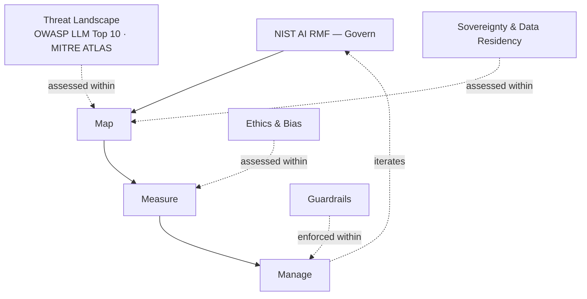

---
tags:
  - security
  - sovereignty
  - governance
---

# AI Security & Risk

Managing what can go wrong in an AI system — from adversarial threats to jurisdictional exposure to unfair outcomes — grounded in the frameworks the field actually uses to structure this work, not an internally invented list.

## In this domain

- **Governance & Risk Culture** — NIST's Govern function: policy, accountability, and organizational risk culture across the AI lifecycle (detail below)
- **[Threat Landscape](guardrails.md)** — OWASP LLM Top 10 and MITRE ATLAS-grounded threats; Guardrails covers the enforceable controls
- **[Sovereignty & Data Residency](sovereign-infrastructure.md)** — where AI compute and models are hosted, under whose jurisdiction ([Mistral AI case study](mistral-ai.md))
- **[Ethics & Bias](ethics-bias.md)** — fairness as a named NIST trustworthy-AI characteristic, not a side concern

## Governance & Risk Culture

NIST's AI RMF structures all AI risk work — including the three subsections above — through four connected functions:

- **Govern** — risk-aware culture, leadership commitment, clear accountability; the foundation the other three functions depend on
- **Map** — contextualizing a specific AI system: what it does, who it affects, what could go wrong
- **Measure** — choosing metrics and methods, evaluating each trustworthiness characteristic (validity, safety, security, fairness, and others), tracking risk over time
- **Manage** — operationalizing the response: controls, incident handling, drift monitoring

This isn't a one-time assessment — it's iterative across the system's life, which is why it wraps every subsection in this domain rather than sitting as a separate checklist.

## IRL Lens

**Focus areas & deep dives** — Sovereignty & Data Residency carries deeper coverage here than its peers in this domain, reflecting active personal focus rather than the field's own weighting; see the [Mistral AI](mistral-ai.md) case study for the EU-sovereignty angle specifically.

**Case studies** — [Sandbox containment failure during an AI capability evaluation](../../reference/case-studies.md) — a direct illustration of Map/Measure/Manage breaking down when guardrails are deliberately reduced for testing.

**Open questions** — see [Landscape](../../reference/landscape.md): sovereign capability gap, safe multi-agent orchestration.

## Related

- [Data Governance](../data-governance/index.md) — access control and classification underpin most security controls
- [Legal & Regulatory](../../reference/legal-regulatory.md) — OWASP LLM Top 10, NIST AI RMF, ISO/IEC 42001
- [Playbook: AI Eval Containment](../../playbooks/ai-eval-containment.md)
- [Playbook: AI Product Alignment — Security & Resilience Non-Negotiables](../../playbooks/ai-product-alignment/security-resilience.md)
