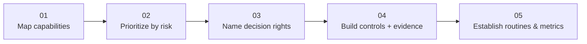

---
tags:
  - governance
  - data
---

# Operationalizing DMBOK 3.0

Five steps — not eleven equal knowledge areas to implement at once.

### 01 · Map capabilities, don't checklist
Assess current maturity across the 11 areas as a capability map. DMBOK is not exhaustive documentation to complete — treat it as a diagnostic instrument.

### 02 · Prioritize by business risk
Not all 11 areas are equally urgent. Rank by current regulatory exposure, incident history, and what AI systems already touch — start there, not alphabetically.

### 03 · Translate to named decision rights
Convert framework concepts into specific people: who approves, who is accountable, who is consulted — per data domain, not as a company-wide policy statement.

### 04 · Build controls with evidence
Every control needs an auditable trace — logs, approvals, classifications — not a policy document asserting the control exists.

### 05 · Establish routines & metrics
Recurring cadence (reviews, audits) plus measurable outcomes. This is the step most programs skip — and exactly why Gartner projects most governance initiatives fail by 2027: the framework exists, but nobody re-checks it against daily work.

!!! warning "Don't lead with all 11 areas"
    Metadata Management, Data Quality, and Data Security are the load-bearing areas for AI systems specifically. The other seven matter but won't block you if under-invested short-term. Presenting "we need all 11 equally" triggers the exact governance-sprawl failure mode Gartner describes.
