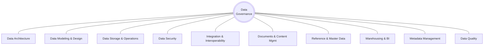

---
tags:
  - governance
  - data
---

# DAMA-DMBOK — The Wheel

11 knowledge areas. Data Governance sits at the center; every other area connects through it.

## Central hub

**Data Governance** — authority, decision rights, and control over data assets. Every other knowledge area routes through this one; it's the layer that makes the other ten enforceable rather than aspirational.

*AI-era extension:* where AI accountability lives in practice — who approved this model touching this data, and who is accountable if it's misused.

## The 10 knowledge areas

| Area | Definition | AI-era extension |
|---|---|---|
| **Data Architecture** | Overall structure of data assets and how they relate to business strategy. | Defines where AI context/vector layers sit relative to systems of record — not a bolt-on. |
| **Data Modeling & Design** | Analysis and design of data structures across the enterprise. | Extends to embedding schemas and context/prompt data structures used by AI systems. |
| **Data Storage & Operations** | Design, implementation, and support of stored data for maximum value. | Now includes vector databases, model checkpoints, and inference caches as first-class assets. |
| **Data Security** | Ensuring privacy, confidentiality, and appropriate access to data. | Extends to model access control, prompt/output logging exposure, and guardrail enforcement. |
| **Integration & Interoperability** | Movement and consolidation of data within and between systems. | Governs RAG pipelines, tool-call data flows, and agent-to-system integration points. |
| **Documents & Content Mgmt** | Managing unstructured data — documents, files, and records. | Direct input source for RAG — quality here caps retrieval quality, and therefore answer quality. |
| **Reference & Master Data** | Managing shared, critical data — customer, product, and core reference records. | The single source of truth AI outputs must be grounded against, or contradictions compound fast. |
| **Warehousing & BI** | Enabling reporting and analytics through structured, integrated data. | Increasingly queried directly by agents, not just dashboards — access patterns need rethinking. |
| **Metadata Management** | Managing data about data — catalogs, lineage, definitions. | The backbone of AI governance: sensitivity tags recorded here should drive routing/access decisions. |
| **Data Quality** | Planning, implementation, and control activities to guarantee usable data. | Directly determines hallucination risk — poor input quality produces confidently-stated errors. |

Next: [Operationalizing the framework →](dmbok-operationalizing.md)

## Related

- [Core Principles](core-principles.md) — the framework-agnostic foundation this wheel sits on top of
- [Enterprise Metadata Model](enterprise-metadata-model.md) — Metadata Management, one of the 11 areas above, expanded
- [Playbook: DAMA-DMBOK Operationalization](../../playbooks/dmbok-operationalization.md)
