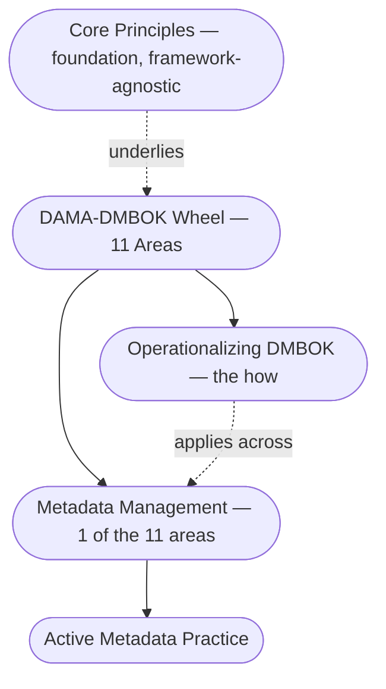

---
tags:
  - governance
  - data
---

# Data Governance

Authority, control, and accountability over data assets — the discipline that makes every other layer of an AI system trustworthy.

## In this domain

- **[Core Principles](core-principles.md)** — the handful of principles that hold regardless of framework
- **[DAMA-DMBOK — The Wheel](dmbok-wheel.md)** — the 11 knowledge areas
- **[Operationalizing DMBOK](dmbok-operationalizing.md)** — a 5-step path from framework to daily practice
- **[Enterprise Metadata Model](enterprise-metadata-model.md)** — what governs what AI can access
- **[Metadata Management — Modern Practice](metadata-management.md)** — active metadata, standards, tooling, and validated industry use cases

## IRL Lens

**Focus areas & deep dives** — [Metadata Management — Modern Practice](metadata-management.md) carries deeper coverage than its peers here, reflecting active personal focus; grounded in named tooling (Gartner's Metadata Management Magic Quadrant) and validated open-source lineage (LinkedIn/DataHub, Lyft/Amundsen, Netflix/Metacat, Uber/Databook), not just personal interest.

**Case studies** — see [Case Studies](../../reference/case-studies.md): the sandbox containment case flags an internal boundary-enforcement gap that's a governance failure as much as a security one.

**Open questions & trends** — see Landscape, below.

## Related

- [Legal & Regulatory](../../reference/legal-regulatory.md) — GDPR, EU AI Act, ISO/IEC 38505, and related standards
- [AI Security & Risk](../ai-security-risk/index.md) — where governance and access control meet
- [Playbook: DAMA-DMBOK Operationalization](../../playbooks/dmbok-operationalization.md)

## Landscape

### Open Questions

No domain-specific open question filed yet — a genuine gap, not an oversight. Worth filling as this domain's IRL Lens accumulates real cases.

### Trends

1. **Active metadata adoption** — A shift from static, manually-maintained catalogs to continuously-updated, bidirectionally-wired metadata practice. See [Metadata Management](metadata-management.md) for the passive-to-active distinction. Gartner's Magic Quadrant for Metadata Management Solutions returned in November 2025 after a five-year pause — itself a signal of how central the discipline has become; the report is analyst-paywalled, not linked here to avoid pointing at vendor-promotional summaries instead.

### Expertise Leads

| Who | Why them |
|---|---|
| **[Robert Seiner](https://tdan.com/)** | Creator of the Non-Invasive Data Governance approach — formalizing stewardship around people already doing the work, rather than top-down appointment |
| **[DAMA International](https://www.dama.org/cpages/body-of-knowledge)** | Publishes DAMA-DMBOK, the reference framework this entire domain is structured around |
| **[Gartner](https://www.gartner.com/en)** | Publishes the Magic Quadrant for Metadata Management Solutions — the standard analyst reference for vendor evaluation in this space. Report itself is paywalled; linked here to Gartner's own site rather than a vendor's promotional summary |

See [Experts & Sources](../../reference/experts.md) for the full directory this is drawn from.
