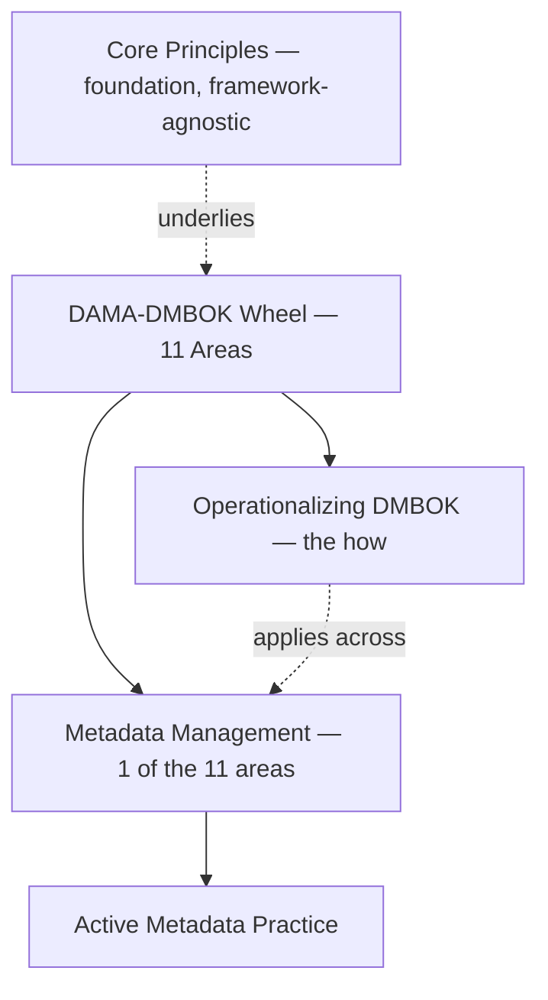

---
tags:
  - governance
  - data
---

# Data Governance

Authority, control, and accountability over data assets — the discipline that makes every other layer of an AI system trustworthy.

## In this domain

- **[Core Principles](core-principles.md)** — the handful of principles that hold regardless of framework
- **[DAMA-DMBOK — The Wheel](dmbok-wheel.md)** — the 11 knowledge areas
- **[Operationalizing DMBOK](dmbok-operationalizing.md)** — a 5-step path from framework to daily practice
- **[Enterprise Metadata Model](enterprise-metadata-model.md)** — what governs what AI can access
- **[Metadata Management — Modern Practice](metadata-management.md)** — active metadata, standards, tooling, and validated industry use cases

## IRL Lens

**Focus areas & deep dives** — [Metadata Management — Modern Practice](metadata-management.md) carries deeper coverage than its peers here, reflecting active personal focus; grounded in named tooling (Gartner's Metadata Management Magic Quadrant) and validated open-source lineage (LinkedIn/DataHub, Lyft/Amundsen, Netflix/Metacat, Uber/Databook), not just personal interest.

**Case studies** — see [Case Studies](../../reference/case-studies.md): the sandbox containment case flags an internal boundary-enforcement gap that's a governance failure as much as a security one.

**Open questions** — see [Landscape](../../reference/landscape.md) for adjacent industry trends.

## Related

- [Legal & Regulatory](../../reference/legal-regulatory.md) — GDPR, EU AI Act, ISO/IEC 38505, and related standards
- [AI Security & Risk](../ai-security-risk/index.md) — where governance and access control meet
- [Playbook: DAMA-DMBOK Operationalization](../../playbooks/dmbok-operationalization.md)
