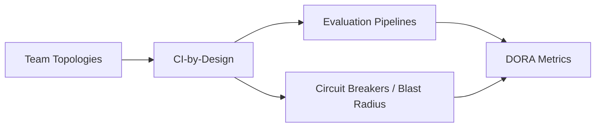

---
tags:
  - ci
  - evaluation
---

# Delivery & Operating Practice

Engineering-delivery mechanics for AI-assisted work — deployment, verification, and recovery — grounded in DORA/Accelerate and Team Topologies. Distinct from [AI Adoption & Organizational Maturity](../ai-adoption-maturity/index.md), which covers whether the *organization* is culturally ready; this domain covers whether the *pipeline* is fast and safe regardless.

## In this domain

- **[CI-Processes-by-Design](ci-by-design.md)** — verification and evaluation as infrastructure, not an afterthought
- **[Team Topologies](team-topologies.md)** — team design patterns: four team types, three interaction modes, and why most AI infrastructure gets rebuilt five times over without this
- **[DORA Metrics](dora-metrics.md)** — the four (now five) metrics, how they've evolved since 2018, and the live debate over whether they still mean what they used to once AI writes a large share of the code

## Grounded in

- **[DORA / *Accelerate*](dora-metrics.md)** (Forsgren, Humble, Kim) — the metrics, and how they've genuinely evolved since 2018, not just the original four
- **[Team Topologies](team-topologies.md)** (Skelton & Pais) — team design patterns for fast, autonomous delivery at scale

## IRL Lens

**Focus areas & deep dives** — none flagged as deep-focus here; this domain's content reflects field-standard weighting.

**Case studies** — see [Case Studies](../../reference/case-studies.md): the sandbox containment case is a recovery/detection failure at the delivery-practice level as much as a security one.

**Open questions & trends** — see Landscape, below.

## Related

- [AI Adoption & Organizational Maturity](../ai-adoption-maturity/index.md) — the organizational-readiness counterpart to this domain's delivery-mechanics focus
- [Evaluation & Observability](../evaluation-observability/index.md) — the Evaluation Pipelines node above, in depth
- [Experts & Sources](../../reference/experts.md) — see the Lean & Resilient Engineering Orgs group
- [Playbook: CI-by-Design](../../playbooks/ci-by-design.md)
- [Playbook: AI Product Alignment & Review](../../playbooks/ai-product-alignment/index.md) — the same handoff-gap discipline applied across a full product lifecycle

## Landscape

### Open Questions

1. **Do the original DORA metrics still mean what they used to?** A growing body of practitioner commentary argues Deployment Frequency and Lead Time for Changes get *misleading*, not just incomplete, once AI generates a large share of committed code — both can look artificially strong while quality and team health quietly erode. Not yet settled consensus; see [DORA Metrics](dora-metrics.md) for the detail.

### Trends

1. **DORA's own 2025 report pivoted entirely to AI-assisted development** — skipping the traditional State of DevOps format for the first time, finding that AI adoption improves throughput but *increases* delivery instability. See [DORA Metrics](dora-metrics.md).
2. **Platform engineering as the organizational answer to AI infrastructure sprawl** — see [Team Topologies](team-topologies.md) for the specific failure mode (every team rebuilding its own AI infrastructure) this trend addresses.

### Expertise Leads

| Who | Why them |
|---|---|
| **[Nicole Forsgren](https://dora.dev/)** | Co-author of *Accelerate*, creator of the DORA metrics — the standard measure of engineering delivery performance |
| **[Matthew Skelton](https://teamtopologies.com/)** | Co-author of *Team Topologies* — team design patterns for fast, autonomous delivery at scale |

See [Experts & Sources](../../reference/experts.md) for the full directory this is drawn from.
