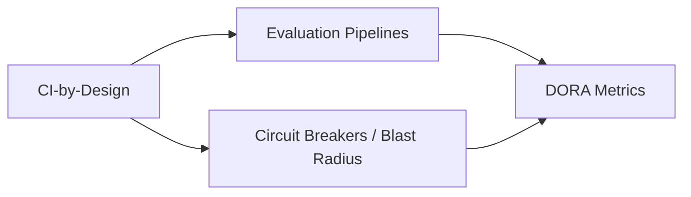

---
tags:
  - ci
  - evaluation
---

# Delivery & Operating Practice

Engineering-delivery mechanics for AI-assisted work — deployment, verification, and recovery — grounded in DORA/Accelerate and Team Topologies. Distinct from [AI Adoption & Organizational Maturity](../ai-adoption-maturity/index.md), which covers whether the *organization* is culturally ready; this domain covers whether the *pipeline* is fast and safe regardless.

## In this domain

- **[CI-Processes-by-Design](ci-by-design.md)** — verification and evaluation as infrastructure, not an afterthought

## Grounded in

- **DORA / *Accelerate*** (Forsgren, Humble, Kim) — the four key metrics: deployment frequency, lead time for changes, change failure rate, time to recover
- **Team Topologies** (Skelton & Pais) — team design patterns for fast, autonomous delivery at scale

## IRL Lens

**Focus areas & deep dives** — none flagged as deep-focus here; this domain's content reflects field-standard weighting.

**Case studies** — see [Case Studies](../../reference/case-studies.md): the sandbox containment case is a recovery/detection failure at the delivery-practice level as much as a security one.

**Open questions** — see [Landscape](../../reference/landscape.md) for adjacent industry trends.

## Related

- [AI Adoption & Organizational Maturity](../ai-adoption-maturity/index.md) — the organizational-readiness counterpart to this domain's delivery-mechanics focus
- [Evaluation & Observability](../evaluation-observability/index.md) — the Evaluation Pipelines node above, in depth
- [Experts & Sources](../../reference/experts.md) — see the Lean & Resilient Engineering Orgs group
- [Playbook: CI-by-Design](../../playbooks/ci-by-design.md)
- [Playbook: AI Product Alignment & Review](../../playbooks/ai-product-alignment/index.md) — the same handoff-gap discipline applied across a full product lifecycle
