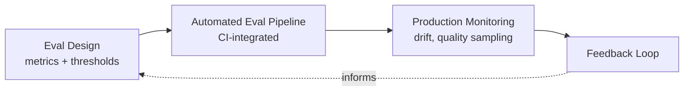

---
tags:
  - evaluation
---

# Evaluation & Observability

Whether an AI system is actually working — measured, not demoed. Elevated to its own domain rather than a footnote under systems engineering, because the field treats it that way: Chip Huyen's *AI Engineering* devotes two of its ten chapters to evaluation before touching implementation, and an entire tooling category (Braintrust, LangSmith, Arize, and others) exists around this specifically.

## In this domain

- **Eval design** — choosing metrics and thresholds before building, not after (detail below)
- **Automated eval pipelines** — evaluation as a CI-integrated gate, not a manual pre-launch check
- **Production monitoring** — drift detection, ongoing quality sampling, not just uptime/latency
- **Feedback loops** — routing real usage signal back into the next iteration

## Grounded in

- **Chip Huyen, *AI Engineering*** — evaluation methodology and evaluating AI systems get two full early chapters, ahead of most implementation topics
- **Stanford CRFM's HELM** (Holistic Evaluation of Language Models) — a named, maintained benchmark framework, useful as a reference point for what rigorous evaluation design looks like at scale

## Eval design — the core discipline

The single most common failure this domain exists to prevent: **eval criteria chosen after the model is already built**, so "good" gets defined retroactively to match whatever the model already does. The fix is procedural, not technical — see the [AI Product Alignment playbook's Stage 2](../../playbooks/ai-product-alignment/stage-2-data-model-design.md), which makes eval thresholds a locked decision before build starts, not a post-hoc judgment call.

A second common failure: evaluation that only covers the happy path. See [Stage 4](../../playbooks/ai-product-alignment/stage-4-governance-review.md) on requiring edge cases and adversarial inputs in the eval set, and [Ethics & Bias](../ai-security-risk/ethics-bias.md) on why a happy-path-only eval set hides disparate outcomes specifically.

## IRL Lens

**Focus areas & deep dives** — none yet; this domain is newly elevated and will accumulate depth as specific evaluation practices get documented.

**Case studies** — see [Case Studies](../../reference/case-studies.md): the sandbox containment case is also an evaluation failure — the capability eval itself lacked containment as part of its own design.

**Open questions** — see [Landscape](../../reference/landscape.md): reliability at scale (can evaluation tooling close the hallucination gap for high-stakes automation).

## Related

- [AI/ML Systems Engineering](../ai-ml-systems-engineering/index.md) — the systems this domain evaluates
- [AI Security & Risk](../ai-security-risk/index.md) — NIST's Measure function overlaps directly with eval design
- [Playbook: AI Product Alignment & Review](../../playbooks/ai-product-alignment/index.md) — Stages 2 and 4 operationalize this domain directly
