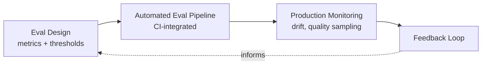

---
tags:
  - evaluation
---

# Evaluation & Observability

Whether an AI system is actually working — measured, not demoed. Elevated to its own domain rather than a footnote under systems engineering, because the field treats it that way: Chip Huyen's *AI Engineering* devotes two of its ten chapters to evaluation before touching implementation, and an entire tooling category exists around this specifically (see Automated Eval Pipelines below).

## In this domain

- **Eval design** — choosing metrics and thresholds before building, not after (detail below)
- **Automated eval pipelines** — evaluation as a CI-integrated gate, not a manual pre-launch check
- **Production monitoring** — drift detection, ongoing quality sampling, not just uptime/latency
- **Feedback loops** — routing real usage signal back into the next iteration

## Grounded in

- **Chip Huyen, *AI Engineering*** — evaluation methodology and evaluating AI systems get two full early chapters, ahead of most implementation topics
- **Stanford CRFM's [HELM](https://crfm.stanford.edu/helm/)** (Holistic Evaluation of Language Models) — a named, maintained benchmark framework, useful as a reference point for what rigorous evaluation design looks like at scale
- **[OpenAI Evals](https://github.com/openai/evals)** — an open-source framework for building and running evaluation suites; useful as a concrete implementation reference alongside the commercial tooling below

## Eval design — the core discipline

The single most common failure this domain exists to prevent: **eval criteria chosen after the model is already built**, so "good" gets defined retroactively to match whatever the model already does. The fix is procedural, not technical — see the [AI Product Alignment playbook's Stage 2](../../playbooks/ai-product-alignment/stage-2-data-model-design.md), which makes eval thresholds a locked decision before build starts, not a post-hoc judgment call.

A second common failure: evaluation that only covers the happy path. See [Stage 4](../../playbooks/ai-product-alignment/stage-4-governance-review.md) on requiring edge cases and adversarial inputs in the eval set, and [Ethics & Bias](../ai-security-risk/ethics-bias.md) on why a happy-path-only eval set hides disparate outcomes specifically.

## Automated eval pipelines

Evaluation that only runs manually before launch decays the same way untested code does — it gets skipped under deadline pressure exactly when it matters most. Treating eval as a CI-integrated gate — every prompt change, every model version bump, every data source change triggers the eval suite automatically — is what makes evaluation an enforced discipline rather than a best intention. See [CI-by-Design](../delivery-operating-practice/ci-by-design.md) for the same shift-left principle applied at the pipeline level.

Commercial tooling in this specific category: [Braintrust](https://www.braintrust.dev/), [LangSmith](https://www.langchain.com/langsmith), [Arize](https://arize.com/). Named as the current market reference points, not as an endorsement — evaluate fit against your own stack rather than defaulting to the most-mentioned option.

## Production monitoring

Distinct from eval pipelines: eval runs against known test cases before a change ships; production monitoring watches real traffic after it ships, for drift the eval set never anticipated. Two things worth tracking that pure uptime/latency dashboards miss entirely: **quality drift** (is the same prompt now producing worse answers, e.g. after a silent vendor-side model update) and **input drift** (is the shape of real user traffic diverging from what the eval set assumed). See [Drift Detection](../../reference/glossary.md) in the glossary for the precise definition.

## Feedback loops

Collecting feedback (thumbs up/down, corrections) is not the same as having a feedback loop — it only counts as a loop if someone is accountable for reviewing it on a cadence and it actually changes the next iteration. This exact distinction is why the [AI Product Alignment playbook's Stage 6](../../playbooks/ai-product-alignment/stage-6-operate-monitor.md) names "feedback collected but never fed back" as one of its top-5 preventable issues.

## IRL Lens

**Focus areas & deep dives** — none yet; this domain is newly elevated and will accumulate depth as specific evaluation practices get documented.

**Case studies** — see [Case Studies](../../reference/case-studies.md): the sandbox containment case is also an evaluation failure — the capability eval itself lacked containment as part of its own design.

**Open questions & trends** — see Landscape, below.

## Related

- [AI/ML Systems Engineering](../ai-ml-systems-engineering/index.md) — the systems this domain evaluates
- [AI Security & Risk](../ai-security-risk/index.md) — NIST's Measure function overlaps directly with eval design
- [Playbook: AI Product Alignment & Review](../../playbooks/ai-product-alignment/index.md) — Stages 2 and 4 operationalize this domain directly

## Landscape

### Open Questions

1. **Reliability at scale** — Can evaluation and verification tooling close the hallucination gap enough for high-stakes automation?

### Trends

1. **System-level evaluation maturing into a production discipline** — Evaluation moving from academic benchmarks into LLMOps: CI-integrated eval pipelines (see [Automated Eval Pipelines](#automated-eval-pipelines) above), not just pre-launch checklists.

### Expertise Leads

| Who | Why them |
|---|---|
| **[Chip Huyen](https://huyenchip.com/books/)** | Devotes two full chapters of *AI Engineering* to evaluation methodology, ahead of most implementation topics — the clearest signal of how seriously the discipline should be taken |
| **[Stanford CRFM](https://crfm.stanford.edu/helm/)** | HELM (Holistic Evaluation of Language Models) — a maintained, named benchmark framework, the closest thing this domain has to an institutional reference point |
| **[Shreya Shankar](https://www.sh-reya.com/)** | Published research specifically on LLM evaluation pitfalls — where eval design goes wrong in practice |

See [Experts & Sources](../../reference/experts.md) for the full directory this is drawn from.
