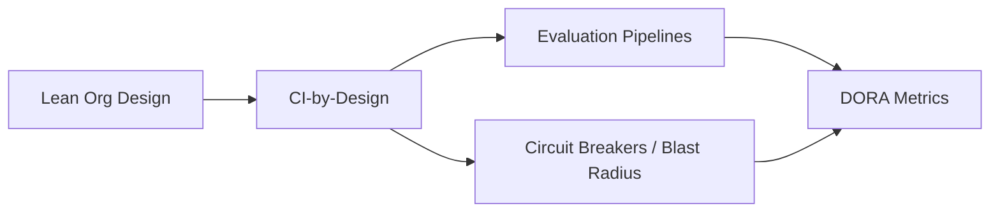

---
tags:
  - lean
  - ci
---

# Lean & Engineering Practice

Operating models and engineering practices that keep AI-assisted work fast, cheap, and safe at the same time, rather than trading one for another.

## In this domain

- **[Lean AI-Assisted Product Organization](lean-ai-org.md)** — the operating model archetype
- **[CI-Processes-by-Design](ci-by-design.md)** — verification and evaluation as infrastructure, not an afterthought

## Related

- [AI Architecture](../ai-architecture/index.md) — the Evaluation & Monitoring cross-cutting concern
- [Experts & Sources](../../reference/experts.md) — see the Lean & Resilient Engineering Orgs group
- [Playbook: CI-by-Design](../../playbooks/ci-by-design.md)
- [Playbook: AI Product Alignment & Review](../../playbooks/ai-product-alignment/index.md) — the same handoff-gap discipline applied across a full product lifecycle
