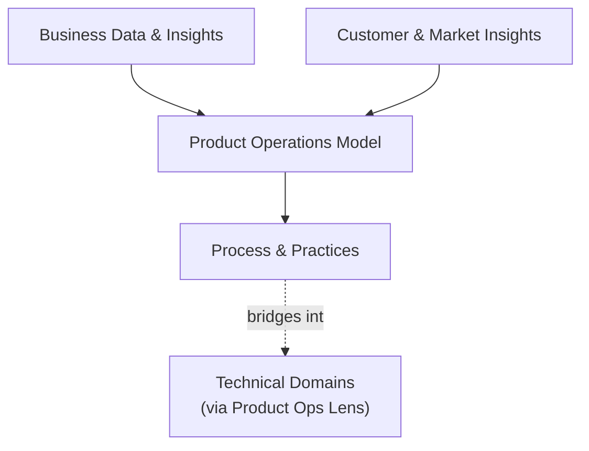

---
tags:
  - lean
  - culture
---

# Product Operations Practice

The discipline of product operations itself — not the technical systems it operates on, but the function, the pillars, and the practice. Every other domain in this hub answers "how does the AI system work." This domain answers "how does product ops actually run, and where does it touch everything else."

## Grounded in

- **[Melissa Perri & Denise Tilles, *Product Operations: How Successful Companies Build Better Products at Scale*](https://melissaperri.com/book)** (2023) — the practitioner-defining text for this discipline, structured around three pillars: Business Data & Insights, Customer & Market Insights, and the Product Operations Model (process & practices). Same tier of grounding this hub applies everywhere else — a named, citable body of knowledge, not an invented structure.

## Why this domain exists, specifically here

Every technical domain in this hub now carries a **Product Ops Lens** section — cross-team dependencies, team topology implications, OKR/roadmap impact, budget impact, who to loop in. That section only works because product operations *as a discipline* has its own real substance behind it: the data, insight-gathering, and process practices Perri and Tilles define. This domain is where that substance lives, rather than being assumed or left implicit every time a technical page needs to reference it.

## The three pillars, and their AI-native-specific edge

- **Business Data & Insights** — connecting financial and operational metrics back to what's actually shipped. In an AI-native context, this is where the [Cost & FinOps](../../reference/cost-finops.md) numbers this hub's technical domains generate actually get turned into a decision a business can act on.
- **Customer & Market Insights** — aggregating feedback and market signal into product decisions. AI-specific edge: user trust and perceived reliability in AI features behave differently from traditional feature feedback — a wrong answer delivered confidently erodes trust faster than a missing feature does.
- **Product Operations Model — process & practices** — the standardized ways of working that let product management scale. This is where [Team Topologies](../delivery-operating-practice/team-topologies.md)'s platform/stream-aligned/enabling distinctions and this hub's [AI Product Alignment playbook](../../playbooks/ai-product-alignment/index.md) actually get operationalized as a repeatable practice, not a one-off review.

Sub-pages for each pillar aren't built yet — this domain currently exists as the grounding and bridge point the Product Ops Lens sections depend on, not a fully fleshed-out set of deep dives. Next to build, in order: the Product Operations Model pillar specifically, since it's the one this hub's playbooks already partially operationalize.

## IRL Lens

**Focus areas & deep dives** — *TBD*

**Case studies** — *TBD*

**Open questions & trends** — see Landscape, below.

## Related

- [Playbook: AI Product Alignment & Review](../../playbooks/ai-product-alignment/index.md) — the operationalized version of the Product Operations Model pillar
- [AI Adoption & Organizational Maturity](../ai-adoption-maturity/index.md) — organizational readiness, adjacent to but distinct from the operational practice itself
- [Team Topologies](../delivery-operating-practice/team-topologies.md) — the team-structure vocabulary this domain's process pillar depends on
- Every domain's own **Product Ops Lens** section — this domain is the substance behind that recurring section, not a duplicate of it

## Landscape

### Open Questions

No domain-specific open question filed yet — a genuine gap, not an oversight. This is the newest domain in the hub.

### Trends

No domain-specific trend filed yet.

### Expertise Leads

| Who | Why them |
|---|---|
| **[Melissa Perri](https://melissaperri.com/)** | Co-author of the defining text for this discipline; also author of *Escaping the Build Trap*; Harvard Business School faculty for Product Management |
| **Denise Tilles** | Co-author; over a decade of product leadership experience, product operations consulting for Fortune 50 and high-growth SaaS companies |

See [Experts & Sources](../../reference/experts.md) for the full directory this is drawn from.
