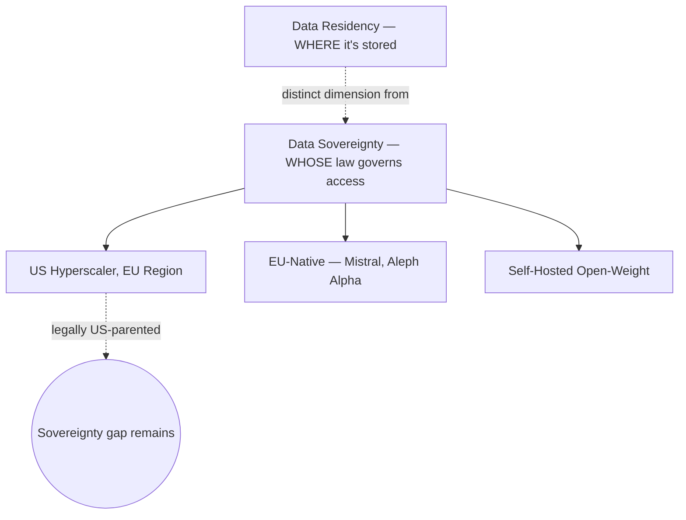

---
tags:
  - sovereignty
---

# Sovereignty & Infrastructure

Where AI compute and models are hosted, under whose legal jurisdiction, and what that means for data that can't leave a given region.

## In this domain

- **[Sovereign Infrastructure Buildout](sovereign-infrastructure.md)** — the distinction between data residency and data sovereignty
- **[Mistral AI](mistral-ai.md)** — a case study in EU-headquartered, open-weight model development

## Related

- [Legal & Regulatory](../../reference/legal-regulatory.md) — EU AI Act, Data Act, and the US regulatory picture
- [Experts & Sources](../../reference/experts.md) — see the EU Sovereignty & Infrastructure group
- [Case Studies](../../reference/case-studies.md) — the operational case for a self-hostable model in reserve
- [Playbook: AI Product Alignment — Security & Resilience Non-Negotiables](../../playbooks/ai-product-alignment/security-resilience.md) — data residency and vendor exit strategy as review-gated controls
