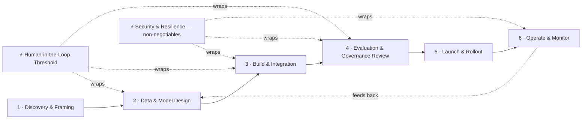

# AI Product Alignment & Review Playbook

## Purpose

Most AI product delays are not technical. They are handoff gaps: a decision nobody wrote down, a question nobody asked, a stage nobody gated. This playbook closes those gaps across the AI product lifecycle: Discovery, Design, Build, Governance Review, Launch, and Operate.

## Who this is for

PMs and Product Ops who are onboarding to AI product development and need to run cross-functional alignment without owning the technical depth themselves. This is the "how" layer. For the "why" behind any concept referenced here, see the corresponding Domain page.

## How to use this playbook

At each stage:

1. Confirm the required roles are actually in the room, not just informed after the fact.
2. Work the **top 5 preventable issues** as a checklist, not a formality.
3. Ask the **stage-gate question** in the stakeholder's own language. A rubber-stamp answer means the stage isn't actually done.
4. Do not move to the next stage until the gate closes clean.

## The lifecycle

- **[Security & Resilience — Non-Negotiables](security-resilience.md)** — 5 cross-cutting controls, designed at Build, verified at Governance Review, drilled at Operate
- **[Human-in-the-Loop Threshold](human-in-the-loop.md)** — which actions run unsupervised, decided before Build starts
- **[Stage 1 — Discovery & Framing](stage-1-discovery.md)**
- **[Stage 2 — Data & Model Design](stage-2-data-model-design.md)**
- **[Stage 3 — Build & Integration](stage-3-build-integration.md)**
- **[Stage 4 — Evaluation & Governance Review](stage-4-governance-review.md)**
- **[Stage 5 — Launch & Rollout](stage-5-launch-rollout.md)**
- **[Stage 6 — Operate & Monitor](stage-6-operate-monitor.md)**

## Roles glossary

Titles vary by org. These are the functions this playbook assumes, mapped to what each function is actually accountable for.

| Role | Owns |
|---|---|
| **Product / Product Ops (PM)** | Problem definition, prioritization, user-facing outcome, go/no-go authority |
| **Data Engineer (DE)** | Pipelines, data infrastructure, freshness, lineage, feature store, ongoing data quality |
| **Data Scientist (DS)** | Model/approach selection, evaluation design, offline metrics, bias and fairness testing |
| **AI/ML Engineer** | Inference infrastructure, orchestration, tool integration, production reliability, cost |
| **Architect** | System design, integration patterns, technical risk tradeoffs, vendor abstraction |
| **Governance / Enablement** | Compliance, audit requirements, risk classification, responsible AI sign-off |
| **Legal / Privacy** | Vendor contract terms (data processing agreements, IP ownership of outputs, liability allocation), regulatory obligations beyond internal governance |
| **Security** | Adversarial testing (prompt injection, jailbreak attempts, data exfiltration through tool calls), access control implementation, incident response |

DS and DE are frequently collapsed into "Data" in early conversations. Keep them separate: DE failures show up as **stale or broken data**, DS failures show up as **wrong or inconsistent model behavior**. Governance and Legal are also frequently collapsed: Governance owns internal risk sign-off, Legal owns what's actually enforceable in a contract. Different accountability, different failure mode if skipped.

## Concepts glossary

Four terms carry the whole playbook. Get these straight before the stage pages — everything below assumes them. (Plain-English register, for PM onboarding specifically — see the [Reference Glossary](../../reference/glossary.md) for the more technical definitions used elsewhere in this hub.)

| Term | Plain-English definition | Common confusion |
|---|---|---|
| **Data** | The information the system reads and writes: source records, documents, transactions. Feeds both what the model is built on and what it retrieves live. | Not the same as "the database." Data has freshness and lineage; a database is just where it sits. |
| **Model** | The trained or pretrained system that actually generates the answer, prediction, or decision. | Not the same as "the app." The model can be swapped, upgraded, or rolled back without the application changing at all. |
| **Evals (evaluations)** | Structured tests that measure whether the model's output is actually good, scored against a metric and threshold agreed in advance. | Not the same as a demo. A demo is one anecdote; an eval is a measurement, run repeatedly, that either passes a threshold or doesn't. |
| **Feedback loop** | The mechanism that routes real usage signal (thumbs up/down, corrections, complaints) back into the next iteration of the model or prompt. | Collecting feedback is not a feedback loop. It only counts if someone is accountable for reviewing it and acting on it on a cadence. |

## Quick reference: who to loop in when

| Symptom | Loop in |
|---|---|
| Answer is slow | AI Engineer (inference, orchestration) |
| Answer is wrong or outdated | Data Engineer (freshness, pipeline) |
| Answer is inconsistent or poorly reasoned | Data Scientist (model, eval) |
| Answer reads badly or tone is off | PM / Product Ops (prompt, UX) |
| Compliance or audit question | Governance / Architect |
| Contract, IP, or liability question | Legal |
| Suspected prompt injection, jailbreak, or data leak | Security |
| Cost is spiking unexpectedly | AI Engineer + PM (usage review) |
| Something needs to be shut off, now | AI Engineer (kill switch), then everyone else |
| Users aren't adopting it even though it works | PM + Enablement |
| Nobody knew it broke until a user complained | Everyone — observability gap, start with AI Engineer |

## Changelog

| Version | Date | Change |
|---|---|---|
| v1 | 2026-08-06 | Initial playbook. Restructured from architecture-layer framing (floors) to PDP-stage framing (handoffs). Added explicit DS/DE role split. Replaced the 6-floor failure-mode list with top-5 preventable issues per stage. |
| v2 | 2026-08-06 | Added Concepts glossary (data, model, evals, feedback loop). Added Security & Resilience non-negotiables section (kill switch, backups, isolation). |
| v3 | 2026-08-06 | Added Legal/Privacy and Security as named roles. Added Human-in-the-loop threshold section. Expanded Security & Resilience to five controls (added data residency/sovereignty and vendor exit strategy). Added Incident postmortem section. Added end-user change management to Stage 5. Extended Stages 1, 3, 4, and 5 with an additional non-negotiable issue each. |
| v4 | 2026-08-06 | Split from single-file into a playbook series (this index + 8 pages) for hub integration. No content changes — restructure only. |
